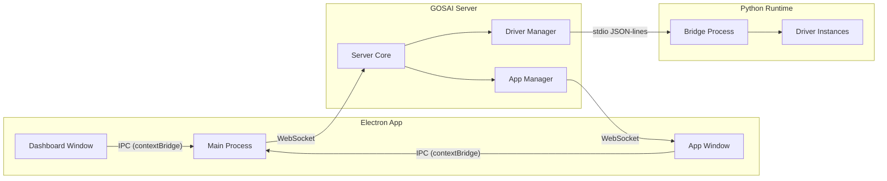

# GOSAI v2 - Rebuild Meta-Plan

## Context

GOSAI is being rebuilt from a legacy Python/Docker/Flask/Redis/Chromium stack into a modern Bun monorepo with an Electron frontend, TypeScript server, and Python runtime for ML/CV. The legacy system's features (HAL drivers, app lifecycle, calibration, event system, performance monitoring) must all be preserved in the new architecture, but implemented cleanly.

---

## Legacy Primitives Inventory (must be supported)

All features from the legacy system that the new GOSAI must support:

**Core Systems:**
- Hardware Abstraction Layer (driver management, event system, dependencies)
- Application lifecycle (start, stop, restart, exclusive mode, required apps)
- Inter-process event bus (pub/sub with data payloads)
- Performance monitoring (loop times, FPS tracking, resource usage)
- Centralized logging (levels: debug, info, warning, error)
- Console/CLI for runtime control
- Platform configuration (camera, apps, calibration settings)

**HAL Drivers (Python, ML/CV):**
- `camera` - Video capture (standard webcam + Intel RealSense depth)
- `calibration` - Camera-projector calibration via ArUco markers
- `ball` - Ball detection via background subtraction + contour analysis
- `pose` - Body pose estimation (MediaPipe/similar)
- `hand_pose` - Hand landmark detection
- `hand_sign` - Hand gesture classification
- `microphone` - Audio input capture
- `speaker` - Audio output / device detection
- `speech_to_text` - STT (Whisper-based)
- `speech_activity_detection` - Voice Activity Detection
- `speech_emo_prediction` - Emotion classification from speech
- `speaker_recognition` - Speaker identification
- `tts` - Text-to-speech synthesis
- `tts_emotion` - Emotional TTS
- `voice_commands` - Wake word + command recognition
- `synthesizer` - Audio synthesis
- `frequency_analysis` - FFT / spectral analysis
- `interpolate` - Data smoothing/interpolation
- `slr` - Sign Language Recognition (ONNX models)
- `pose_to_mirror` - Pose reflection/mirroring
- `web_audio_stream` - Browser audio streaming
- `sensor_server` - External sensor data ingestion

**Display/Frontend:**
- Fullscreen rendering on configurable display
- P5JS sketch instances per experience
- Calibration matrix application (projection mapping)
- Real-time data streaming to display (60+ FPS)
- Dynamic module loading/unloading
- Multiple concurrent sketches/canvases

**Application Features:**
- Apps declare driver requirements -> drivers auto-start
- Apps receive real-time driver event data
- Apps can execute driver commands/callbacks
- Apps can start/stop other apps
- Exclusive mode (app closes others)
- Sub-menus / options per app
- State machines for experience flow

---

## Architecture Decision Record

### Monorepo Structure

```
gosai-2/
├── package.json              # Bun workspace root
├── bunfig.toml
├── tsconfig.json             # Base TypeScript config
├── packages/
│   ├── server/               # Core backend (Bun/Node runtime)
│   │   ├── package.json
│   │   ├── src/
│   │   │   ├── index.ts          # Entry point
│   │   │   ├── ipc/             # IPC bus (replaces Redis)
│   │   │   ├── drivers/         # Driver manager (orchestrates Python)
│   │   │   ├── apps/            # App lifecycle manager
│   │   │   ├── config/          # Configuration management
│   │   │   ├── logger/          # Logging system
│   │   │   └── monitor/         # System monitoring
│   │   └── tsconfig.json
│   ├── desktop/              # Electron app (electron-vite + React)
│   │   ├── package.json
│   │   ├── electron.vite.config.ts
│   │   ├── src/
│   │   │   ├── main/            # Electron main process
│   │   │   ├── preload/         # Preload scripts
│   │   │   └── renderer/        # React UI
│   │   │       ├── pages/
│   │   │       │   ├── dashboard/   # Main management UI
│   │   │       │   └── app-host/    # Fullscreen app window
│   │   │       └── components/
│   │   └── tsconfig.json
│   ├── sdk/                  # TypeScript SDK for app developers
│   │   ├── package.json
│   │   ├── src/
│   │   │   ├── index.ts
│   │   │   ├── types.ts         # App manifest, experience types
│   │   │   ├── client.ts        # Connection to GOSAI server
│   │   │   └── renderer.ts      # Display utilities
│   │   └── tsconfig.json
│   └── shared/               # Shared types and utilities
│       ├── package.json
│       ├── src/
│       │   ├── types.ts
│       │   ├── events.ts
│       │   └── protocol.ts      # IPC protocol definitions
│       └── tsconfig.json
├── python/                   # Python environment (uv-managed)
│   ├── pyproject.toml
│   ├── src/
│   │   └── gosai_py/           # Python SDK package
│   │       ├── __init__.py
│   │       ├── driver.py        # Base driver class
│   │       ├── bridge.py        # Communication bridge to server
│   │       └── drivers/         # Built-in driver implementations
│   └── tests/
├── apps/                     # Built-in apps
│   └── calibration/          # Built-in calibration app
│       ├── gosai.app.json    # App manifest
│       ├── package.json
│       ├── src/
│       │   ├── experiences/
│       │   └── python/
│       └── assets/
├── templates/                # App starter template
│   └── basic/
└── memory/                   # Agent work summaries
```

### Key Technology Choices

| Concern | Choice | Rationale |
|---------|--------|-----------|
| Monorepo | Bun workspaces | Fast, native TS, workspace:* protocol |
| Server runtime | Bun | Fast startup, native TS, built-in server |
| HTTP/WS framework | Hono + Bun WebSocket | Lightweight, fast, works natively with Bun |
| Electron build | electron-vite v5 | Mature, fast HMR, clean main/preload/renderer split |
| Frontend framework | React 19 + TypeScript | Ecosystem, electron-vite support |
| Python management | uv | 10-100x faster than pip, lockfile, venv management |
| Node-Python IPC | stdio JSON-line protocol | No external deps, fast, debuggable |
| Inter-process bus | WebSocket (server<->desktop), stdio (server<->python) | Replaces Redis entirely |
| Serialization | JSON + MessagePack (binary data) | Replaces insecure pickle |
| Embedded terminal | xterm.js v6 + node-pty | Full terminal emulation in Electron |
| App isolation | Child processes (fork/spawn) | Crash isolation, resource tracking |
| Packaging | electron-builder (with bun workarounds) | Most mature for cross-platform |
| CSS | Tailwind CSS v4 | Utility-first, minimal bundle, clean UI |

### Communication Architecture



---

## Phase Plans

Each phase below defines the scope for one agent. Agents execute sequentially. Each agent must write a summary of their work to `gosai-2/memory/` upon completion.

---

### Phase 1: Foundation and Infrastructure

**Goal:** Set up the complete monorepo scaffolding, tooling, and build pipeline so that all subsequent agents have a working development environment.

**Scope:**
- Initialize bun workspace with all package directories
- Configure TypeScript (strict mode, path aliases, composite projects)
- Set up `packages/shared` with core type definitions and protocol types
- Set up uv Python environment in `python/` with pyproject.toml
- Configure electron-vite in `packages/desktop` (empty shell Electron app that launches)
- Set up `packages/server` with a minimal Bun HTTP server that starts
- Wire workspace dependencies (`shared` imported by `server`, `desktop`, `sdk`)
- Add root scripts: `dev` (starts server + desktop concurrently), `build`, `clean`
- Verify: `bun run dev` boots both the server and Electron window

**Key decisions for this agent:**
- Use `electron-vite` v5 for the desktop package (not electron-forge)
- TypeScript strict mode everywhere, ES2022 target
- React 19 in the renderer
- Tailwind CSS v4 for styling (no component libraries)
- `@gosai/shared`, `@gosai/server`, `@gosai/desktop`, `@gosai/sdk` package names

**Output:** A fully scaffolded monorepo where `bun install` and `bun run dev` work.

---

### Phase 2: Core Server - IPC, Drivers, and App Lifecycle

**Goal:** Build the GOSAI server with the event bus, driver management (Python bridge), app lifecycle management, config system, and logging.

**Scope:**
- **IPC Event Bus** (`packages/server/src/ipc/`): WebSocket-based pub/sub that replaces Redis. Typed events, subscribe/unsubscribe, broadcast, direct messaging.
- **Driver Manager** (`packages/server/src/drivers/`): Orchestrates Python driver processes. Spawns/stops drivers. Routes events between drivers and apps. Tracks driver state (available, running, paused). Auto-starts driver dependencies.
- **Python Bridge** (`packages/server/src/drivers/bridge.ts`): Spawns a long-running Python process. Communicates via stdin/stdout using newline-delimited JSON. Handles commands: start_driver, stop_driver, get_data, execute_callback.
- **App Manager** (`packages/server/src/apps/`): Discovers installed apps (reads manifest files). Starts/stops app processes. Tracks running apps and their driver subscriptions. Handles app crashes gracefully (restart or report, never crash server). Supports "exclusive" mode and required apps.
- **Config System** (`packages/server/src/config/`): Global GOSAI config (display settings, default drivers). Per-app isolated config and storage directories. Config files in JSON format.
- **Logger** (`packages/server/src/logger/`): Structured logging with levels. Log streaming to connected clients via WebSocket. Log persistence to disk (rolling files).
- **System Monitor** (`packages/server/src/monitor/`): Track driver loop times, app resource usage, FPS. Expose metrics via WebSocket events.
- **App Installation** (`packages/server/src/apps/installer.ts`): Clone git repos, run install steps, validate manifest.

**Key interfaces (defined in `@gosai/shared`):**
- `AppManifest` - slug, name, description, icon, experiences list
- `ExperienceManifest` - slug, name, entry point, driver requirements
- `DriverEvent` - driver name, event name, data payload, timestamp
- `AppMessage` - from app to server (subscribe, unsubscribe, emit, execute)
- `ServerMessage` - from server to app (event data, lifecycle commands)

**Python side** (`python/src/gosai_py/`):
- `bridge.py` - Main process that receives JSON commands from stdin, routes to drivers
- `driver.py` - Base driver class (loop-based, event-based, or callback-based)
- Drivers run as threads within the bridge process (same as legacy, but communicating via JSON instead of Redis)

**Output:** A server that can start, load a dummy driver, start/stop apps, stream events, and log.

---

### Phase 3: Electron Desktop Application

**Goal:** Build the Electron app with the management dashboard, app window system, embedded terminal, and display configuration.

**Scope:**
- **Main Process** (`packages/desktop/src/main/`):
  - Window management: Dashboard window + fullscreen App window(s)
  - Display enumeration using Electron's `screen` API
  - App window spawning on configured display (fullscreen, frameless)
  - IPC bridge between renderer and main process (contextBridge)
  - WebSocket client connecting to GOSAI server
  - node-pty integration for embedded terminal

- **Dashboard Window** (`packages/desktop/src/renderer/pages/dashboard/`):
  - **App Library:** Grid of installed apps with icons, names, descriptions
  - **App Install:** Input box for git repo URL, installation progress
  - **Running Apps:** Status of currently running app/experiences with quit/kill buttons
  - **Display Settings:** Select which display renders apps, resolution info
  - **Drivers Panel:** List of available drivers, their status, registered listeners
  - **System Monitor:** Real-time FPS, loop times, memory/CPU usage charts
  - **Embedded Terminal:** xterm.js terminal connected to system shell via node-pty
  - **Logs Viewer:** Filterable, real-time log stream from the server

- **App Host Window** (`packages/desktop/src/renderer/pages/app-host/`):
  - Fullscreen frameless window on the configured display
  - Loads the running experience's frontend code
  - Sandboxed: app crash doesn't crash Electron main
  - Communication channel to GOSAI server for real-time data

- **Preload Scripts** (`packages/desktop/src/preload/`):
  - Dashboard preload: exposes server connection, app management APIs
  - App-host preload: exposes GOSAI SDK client API (event subscription, data streaming)

**UI Design principles:**
- Dark theme, minimal, no decorative elements
- Monospace font for technical info, sans-serif for labels
- Responsive layout that works from 1024px to 4K
- No animations beyond essential state transitions
- High contrast text, muted borders

**Output:** A working Electron app with dashboard showing installed apps, display selector, terminal, and the ability to open a fullscreen window on a chosen display.

---

### Phase 4: SDK and Application Framework

**Goal:** Build the SDK packages (TypeScript + Python) that app developers use, define the app manifest format, create the starter template, and implement the experience system.

**Scope:**
- **TypeScript SDK** (`packages/sdk/`):
  - `GosaiApp` class - main entry point for apps
  - `Experience` class - defines a single experience with lifecycle hooks
  - `DriverClient` - subscribe to driver events, execute commands
  - `Renderer` - utilities for canvas/WebGL rendering in the app window
  - `ExperienceRouter` - switch between experiences programmatically
  - `Storage` - per-app isolated key-value storage API
  - `Logger` - app-level logging that routes to GOSAI logger
  - Type exports for all events, driver data shapes, manifests

- **Python SDK** (`python/src/gosai_py/`):
  - `BaseDriver` class - equivalent of legacy but with JSON-line IPC
  - `BaseProcessor` class - for apps that need Python processing
  - Event emission/subscription helpers
  - numpy/cv2 integration utilities (frame serialization)
  - Lifecycle hooks: `pre_run`, `loop`, `on_event`, `cleanup`

- **App Manifest Format** (`gosai.app.json`):
  ```json
  {
    "slug": "interactive-pool",
    "name": "Interactive Pool",
    "description": "Augmented reality pool table",
    "version": "1.0.0",
    "icon": "./assets/icon.png",
    "experiences": [
      {
        "slug": "menu",
        "name": "Main Menu",
        "entry": "./src/experiences/menu/index.ts",
        "python": "./src/python/menu.py",
        "drivers": ["hand_pose", "hand_sign"],
        "exclusive": false
      }
    ],
    "python": {
      "requirements": "./requirements.txt"
    },
    "startup": ["menu"]
  }
  ```

- **App Template** (`templates/basic/`):
  - Ready-to-clone template with a single "hello world" experience
  - Demonstrates: driver subscription, canvas rendering, Python processing, experience switching
  - Includes README with getting-started instructions

- **Experience System:**
  - Each experience runs independently in the app-host window
  - Experiences can programmatically switch to other experiences
  - Experience lifecycle: `init` -> `start` -> `running` -> `stop` -> `cleanup`
  - Multiple experiences CAN run concurrently within one app

- **Documentation** (brief, in SDK README):
  - App structure guide
  - Manifest reference
  - SDK API reference
  - Driver data type reference

**Output:** A working SDK where creating a new app with `gosai.app.json`, an experience file, and optionally Python code produces a functional app that GOSAI can install and run.

---

### Phase 5: Built-in Calibration Application

**Goal:** Implement the calibration system as a built-in GOSAI app using the SDK. This validates the SDK and provides essential camera-projector calibration.

**Scope:**
- **Calibration App** (`apps/calibration/`):
  - Uses the SDK and app manifest format
  - Built-in (ships with GOSAI, always available)

- **Experiences:**
  1. `camera-display` - Projects ArUco markers, detects them via camera, computes homography matrix
  2. `display-focus` - Define focus area within the projection (interactive point selection)
  3. `background-capture` - Capture empty background for subtraction algorithms
  4. `preview` - Show calibrated coordinate mapping in real-time

- **Calibration Data:**
  - Stored per-app in isolated config (JSON format)
  - Matrices: camera_to_display, display_to_camera, display_to_focus, focus_to_display, camera_to_focus, focus_to_camera
  - Apps access calibration data through SDK storage API

- **Python Driver** (`python/src/gosai_py/drivers/calibration.py`):
  - ArUco marker detection (cv2.aruco)
  - Homography matrix computation (cv2.findHomography)
  - Perspective warp utilities

- **Camera Driver** (`python/src/gosai_py/drivers/camera.py`):
  - Standard webcam capture (cv2.VideoCapture)
  - Intel RealSense depth camera support (optional, behind feature flag)
  - Configurable resolution and FPS
  - Frame events: `color`, `depth`

**Output:** A working calibration app that can calibrate a camera-projector setup and persist the matrices for other apps to use.

---

### Phase 6: Core Python Drivers

**Goal:** Port the essential drivers from the legacy system to the new Python SDK format. Focus on the most commonly used drivers.

**Scope (priority order):**

1. **hand_pose** - Hand landmark detection (MediaPipe Hands)
   - Events: `raw_data` (21 landmarks per hand, normalized coordinates)

2. **hand_sign** - Hand gesture classification
   - Events: `sign` (recognized gesture label)
   - Depends on: `hand_pose`

3. **pose** - Body pose estimation (MediaPipe Pose)
   - Events: `landmarks` (33 body landmarks)

4. **ball** - Object/ball detection via background subtraction
   - Events: `balls` (list of x,y positions), `fps`
   - Uses calibration data for coordinate mapping

5. **microphone** - Audio input
   - Events: `audio_chunk` (raw PCM data)
   - Device enumeration and selection

6. **speaker** - Audio output
   - Commands: `play` (play audio data)
   - Device enumeration

7. **speech_to_text** - Speech transcription
   - Events: `transcription` (text result)
   - Depends on: `microphone`
   - Uses faster-whisper

8. **speech_activity_detection** - VAD
   - Events: `activity` (boolean voice detected)
   - Depends on: `microphone`

9. **frequency_analysis** - FFT analysis
   - Events: `spectrum` (frequency bins)
   - Depends on: `microphone`

10. **interpolate** - Data smoothing
    - Configurable smoothing for any numeric stream

**Each driver must:**
- Extend `BaseDriver` from the Python SDK
- Declare its events and dependencies
- Handle lifecycle (pre_run, loop, cleanup)
- Serialize data as JSON (numpy arrays -> lists)
- Be documented with input/output types

**Output:** A set of working Python drivers that apps can subscribe to for real-time ML/CV/audio data.

---

### Phase 7: Integration, Polish, and Packaging

**Goal:** Wire everything together end-to-end, validate with a demo app, fix edge cases, and configure packaging for standalone distribution.

**Scope:**
- **End-to-end validation:**
  - Install the template app via the dashboard git URL input
  - Launch an experience that uses hand tracking + display rendering
  - Verify crash isolation (broken app doesn't crash server)
  - Verify experience switching works
  - Verify multiple displays work

- **App installation flow:**
  - Paste git URL -> clone -> detect `gosai.app.json` -> install deps (bun + uv) -> show in library
  - Handle errors gracefully (invalid repo, missing manifest, failed deps)
  - Remove/uninstall apps

- **Packaging:**
  - electron-builder config for macOS (DMG) and Linux (AppImage)
  - Bundle the server, Python environment, and built-in apps
  - Include uv binary for app Python dependency installation
  - ASAR packaging for the Electron app
  - Test that packaged app launches correctly

- **Developer experience:**
  - `bun run dev` starts everything with hot reload
  - Server hot-reloads on TypeScript changes
  - Desktop hot-reloads renderer (Vite HMR)
  - Python drivers reload on file change

- **Edge cases and hardening:**
  - Graceful shutdown (SIGINT/SIGTERM handling)
  - Process orphan cleanup
  - Memory leak auditing (WebSocket connections, event listeners)
  - Port conflict handling
  - Permission minimization (no wildcard CORS, locked ports)

- **Final documentation:**
  - Root README with architecture overview
  - Quick-start guide for developers
  - Deployment/packaging guide

**Output:** A complete, packaged GOSAI v2 that can be distributed and used to build augmented reality applications.

---

## Cross-Cutting Concerns (every agent must follow)

### Code Quality Rules
- TypeScript strict mode, no `any` types without justification
- ESLint + Prettier configured and enforced
- No console.log in production paths (use logger)
- Proper error handling (no swallowed errors)
- Memory-conscious: clean up listeners, close connections, terminate processes
- Thread-safe Python code (proper locking where needed)
- Efficient serialization (avoid redundant copies of large data like frames)

### Security Rules
- No wildcard CORS in production
- Electron: `contextIsolation: true`, `nodeIntegration: false`, preload scripts with contextBridge
- No pickle serialization (JSON or MessagePack only)
- No hardcoded secrets or passwords
- Validate all IPC messages against schemas
- App processes run with minimum permissions

### UI Rules
- Dark theme, minimal, no gradients or shadows
- Monospace for code/data, system sans-serif for UI
- No component libraries (raw Tailwind)
- Responsive from 1024px to 4K
- No emojis, no decorative icons (only functional)
- Accessible: proper contrast ratios, keyboard navigation

### Agent Behavior Rules
- Never build stubs or placeholder implementations. Complete all tasks fully.
- Write a comprehensive summary to `gosai-2/memory/phase-N-summary.md` when done.
- Before marking as complete, spin up a self-review subagent to validate work quality.
- Follow each language and framework's best practices.
- Prefer the latest stable version of all dependencies.
- Test that things actually work (run builds, verify imports resolve).
