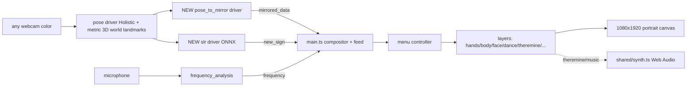

# Port second-self to the new GOSAI SDK

## Goal & approach
Recreate all of second-self as **one built-in app** at `/Users/tfocone/Repos/gosai/apps/second-self`, following the [interactive-pool](/Users/tfocone/Repos/gosai/apps/interactive-pool/src/main.ts) reference exactly: a single `main` experience that is a **compositor** owning one fullscreen canvas, subscribing to drivers once into a mutable feed, and toggling internal **layers** (one per legacy experience) via an in-process **menu controller** that replaces the old `core-app_manager-*` socket protocol. Everything is TypeScript, `strict`, bundled with `bun build ... --external @gosai/sdk`.

The legacy `pose_to_mirror`, `slr`, and `synthesizer` do not exist in the new platform, so per your instruction we rebuild them: the first two as **new built-in Python drivers** in `gosai/python`, and the synthesizer as **in-browser Web Audio** (no Python round-trip).

## Data flow

## Key decisions (please confirm at review)
- **One experience, internal layers** (mirrors interactive-pool). The legacy socket-based app-manager becomes an in-process `MenuController` enforcing `exclusive`/`allowed`/`required` between layers; legacy `sub-menu.json` options become per-layer in-process toggles.
- **Rendering: Canvas2D + TypeScript, drop p5.js** (interactive-pool sets this precedent; "modern/clean/type-safe"). Only `aria` keeps real libraries via npm: `three`, `@pixiv/three-vrm`, `kalidokit`. `sign_game`'s sketchy "Scribble" look is reimplemented with a small helper (or simplified).
- **SLR: port the real legacy ONNX models** (`slr_16.onnx`/`slr_17.onnx` exist in `/Users/tfocone/Repos/gosai-old/core/hal/drivers/slr/models`, currently LFS pointers). This is faithful and strictly better than a from-scratch classifier; `sign_training`'s `slr_samples/*.json` still drive the correction-overlay. (This refines the "lightweight pose-based" questionnaire answer now that the trained models are available.)
- **Synthesizer: Web Audio** in `src/shared/synth.ts`, replicating [synthesizer.py](/Users/tfocone/Repos/gosai-old/core/hal/drivers/synthesizer/synthesizer.py) (sine oscillator for the live theremin; scheduled note queue for score playback).
- **No RealSense at all — webcam-only via MediaPipe 3D.** MediaPipe Holistic already computes metric 3D (`body_world_pose` = `pose_world_landmarks`, in meters) plus per-landmark `z`; the reflection projection uses that instead of a depth sensor. We lift the hip-relative metric skeleton into camera space with a weak-perspective scale (`distance ~= focal * realSize / pixelSize` from shoulder/eye spacing), anchor hands/face to body-joint depth (legacy `ref` trick), and project eye->point->mirror with a plain pinhole model (focal from FOV/one-time calibration) + camera tilt theta. This removes `pyrealsense2` and the `realsense` extra. Optional future boost: a monocular metric-depth model (Depth Anything V2 / Apple Depth Pro) can feed a dense depth map into the same code path. Tradeoff: absolute scale is resolved by a one-time per-install scale (the rig is fixed; `config.json` already encodes per-install offsets) and/or auto-estimated from body proportions.
- **Portrait reference space 1080x1920** (vs interactive-pool's landscape), matching `/Users/tfocone/Repos/second-self/config.json`.

## New GOSAI drivers (in `/Users/tfocone/Repos/gosai/python`)
- `src/gosai_py/drivers/pose_to_mirror.py` — `BaseProcessor`, `subscribed=(("pose","raw_data"),)`, **webcam-only (no depth sensor)**; emits `mirrored_data` (+ `projected_data`); actions `set_mirror_config`. Reflection projection is rebuilt on MediaPipe 3D: take `body_world_pose` (metric, hip-relative), recover camera distance via weak-perspective scale, anchor hands/face to body joints, deproject with a numpy pinhole model (no `pyrealsense2`), then port [mirror.py](/Users/tfocone/Repos/gosai-old/core/hal/drivers/pose_to_mirror/utils/mirror.py) (mm->1080x1920 + per-part lerp) and the projection structure of [reflection.py](/Users/tfocone/Repos/gosai-old/core/hal/drivers/pose_to_mirror/utils/reflection.py)/[pose_to_mirror.py](/Users/tfocone/Repos/gosai-old/core/hal/drivers/pose_to_mirror/pose_to_mirror.py). Mirror config defaults from `config.json` (`x_offset -230, y_offset 100, screen 392.85x698.4 mm -> 1080x1920, tilt 17 deg`).
- `src/gosai_py/drivers/slr.py` (+ small support module + bundled models) — `BaseProcessor`, `subscribed=(("pose","raw_data"),)`, buffers 30 frames, `adapt_data` = face[4 lm]+pose[33]+lh[21]+rh[21] = 158 floats/frame, runs `slr_<numActions>.onnx`, emits `new_sign {guessed_sign, probability}`; action `set_actions`. Ports [slr.py](/Users/tfocone/Repos/gosai-old/core/hal/drivers/slr/slr.py) + [get_sign.py](/Users/tfocone/Repos/gosai-old/core/hal/drivers/slr/utils/get_sign.py). Bundle models as package data (since they are not on a public CDN, unlike ball's downloaded `yolov8n.onnx`).
- Keep `frequency_analysis`, `hand_sign` as-is (already equivalent). The `pose` driver already emits `body_world_pose` (metric 3D) so no change is required; optionally switch its face/hand serializers to `to_xyzv` to retain per-landmark `z` for finer projection. No `pyrealsense2` / `realsense` extra is introduced.

## App structure (`/Users/tfocone/Repos/gosai/apps/second-self`)
- `gosai.app.json` — one `main` experience; `requirements:{display:true,camera:true,microphone:true,speaker:false}`; `drivers:["pose","pose_to_mirror","frequency_analysis","slr"]`; `builtin:true`.
- `src/main.ts` — compositor: portrait canvas, subscribe `pose_to_mirror.mirrored_data` + `frequency_analysis.frequency` + `slr.new_sign` into `MirrorFeed`; run `MenuController` + layer lifecycle + render loop.
- `src/shared/` — `types.ts` (typed `MirroredData`, `FrequencyData`, `SignData`, `Layer`, `FrameContext`), `feed.ts`, `mirror.ts` (MediaPipe hand/body/face connection tables + 1080x1920 helpers), `canvas.ts`, `synth.ts` (Web Audio), `menu-controller.ts`.
- `src/layers/` — one file per experience: `menu`, `hands`, `body`, `face`, `clock`, `poke-it`, `bounce`, `show-frequency`, `show-ping`, `dance`, `theremine`, `music-training`, `sign-game`, `sign-training`, `aria`.
- `assets/` — copied from second-self (see below).
- `package.json`/`tsconfig.json` mirror interactive-pool; add `three`,`@pixiv/three-vrm`,`kalidokit` deps for aria.

## Per-experience mapping (legacy -> layer)
- `menu` -> `menu.ts`: reads `mirrored_data.right_hand_pose[8]`; dwell-select bubbles/bars; drives `MenuController` start/stop + option toggles (in-process).
- `hands`/`body`/`face` -> overlays drawing hand(21)/body(33)/face_mesh connection tables from the feed; persistent.
- `clock` -> local-time analog overlay; no driver.
- `poke-it`/`bounce` -> index-tip (lm 8) and hand-paddle physics from hands.
- `show-frequency` -> `frequency` (`max_frequency`,`rfft`,`amplitude`); `show-ping` -> WS round-trip via `rt.app.server` (replaces socket ping).
- `dance` -> compares `body_pose` to `assets/dance/dance02.json`; shows reference `dance02.gif`.
- `theremine`/`music-training` -> hands + `frequency`; audio via `shared/synth.ts`; scores from `assets/music/*.json`.
- `sign-game`/`sign-training` -> `slr.new_sign` + `mirrored_data`; videos/sprites/backgrounds/font/slr_samples from assets.
- `aria` -> `three`+`@pixiv/three-vrm`+`kalidokit` solving `mirrored_data`/`pose`; needs the user-provided `.vrm`.

## Assets (copy into `apps/second-self/assets/`)
- Present & real: `dance02.json`, sign_game backgrounds/sprites/`PressStart2P.ttf`/`script.txt`, `sign_training/slr_samples`, music/theremine score JSON.
- **Run `git lfs pull`** in `/Users/tfocone/Repos/second-self` (menu `.svg` icons, 45 sign `.webm`, 56 MB dance `.gif`) and in `/Users/tfocone/Repos/gosai-old` (SLR `.onnx`) before copying.
- User-provided: `papa_de_him_chan.vrm` (aria) — layer renders a placeholder until supplied.
- Do **not** copy aria's vendored `three/` tree; use npm.

## Platform wiring & docs
- Add `second-self` to the root `build:apps` script in [package.json](/Users/tfocone/Repos/gosai/package.json).
- Register/verify new drivers via the bridge auto-discovery test in `python/tests`.
- Docs: `apps/second-self/README.md` (experiences, drivers, build, calibration config, assets), and short driver notes for `pose_to_mirror`/`slr`.

## Validation
- `bun run --filter second-self typecheck` + `build`; `bun run typecheck` (workspace); `cd python && uv run ruff check src && uv run pytest -q`. Per your rule, do not run the app; rely on builds/typecheck (the dev watcher applies changes).

## Risks / open items
- Webcam 3D (MediaPipe) is robust but absolute metric scale is camera-ambiguous; resolved by a one-time per-install scale (fixed rig) and/or body-proportion auto-estimate. Expected on-par-or-better than RealSense at mirror range; can be upgraded later with a monocular metric-depth model.
- `aria` needs the VRM file; `sign_*` need the SLR ONNX (LFS) — both gated on `git lfs pull` / your upload.
- This is a large surface (15 layers + 2 drivers); building "all in one pass" is sequenced in the todos below.